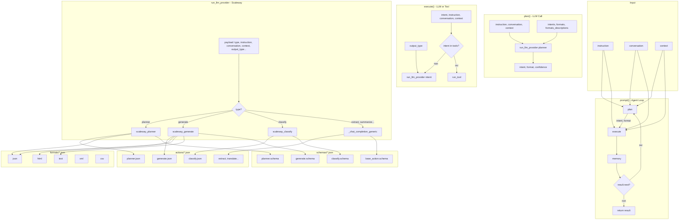

# Agent Architecture

This document describes how the AI agent works: planner, execution loop, formats, schemas, and actions.

## Flow Diagram

## Components

### 1. prompt() — Agent Loop

Entry point. For each step (max 8):

1. **plan** — Chooses intent + format from instruction, conversation, context
2. **execute** — Runs the intent (LLM or registered tool)
3. **memory** — Records step in history
4. **next** — If `result.next` exists, continues loop with that instruction; else returns

### 2. plan() — Planner

Calls `run_llm_provider` with `type: "planner"`. Provides:

- `instruction`, `conversation`, `context` — For format choice (e.g. context.input=richtext → html)
- `intents` — Available actions (extract, generate, classify, chat, etc.)
- `formats` — json, xml, csv, html, text
- `formats_descriptions` — Descriptions from `formats/*.json` (helps choose richtext → html)

Returns `{intent, format, confidence}`. If confidence < 0.6, falls back to `chat` + `json`.

### 3. execute() — Executor

- If intent is a **registered tool** → `run_tool()`
- Else → `run_llm_provider` with `type: intent`, `output_type: format`

### 4. run_llm_provider — Provider Dispatch

Routes by `type`:

- `planner` → `scaleway_planner` (schema with intents/formats enums)
- `generate` → `scaleway_generate` (schema from `generate.schema` + format)
- `classify` → `scaleway_classify` (schema with labels enum)
- Other intents → `_chat_completion_generic` (uses `{intent}.schema` or `base_action.schema`)

Accumulates usage (input_tokens, output_tokens, cost) per call.

### 5. actions/

Templates for prompts: `{{instruction}}`, `{{conversation}}`, `{{context}}`, etc.

- `planner.json` — Chooses intent and format
- `generate.json` — Document generation
- `classify.json` — Intent classification
- `extract.json`, `translate.json`, etc. — Generic intents

### 6. formats/

Output type configs: `description`, `instruction` (appended to system prompt), `parse`, `content_type`.

- `json` — Structured JSON (schema-enforced for Scaleway)
- `html` — HTML for emails, rich content
- `text` — Plain text
- `xml`, `csv` — Structured formats

### 7. schemas/

JSON schemas for structured output:

- `planner.schema.json` — intent (enum), format (enum), confidence
- `generate.schema.json` — content, next
- `classify.schema` — classify (enum), confidence
- `base_action.schema.json` — Fallback for generic intents
